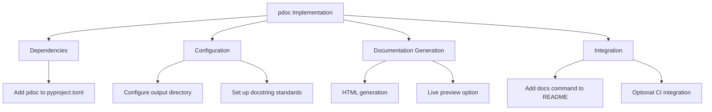

# Documentation Generation Plan (pdoc)

## Overview


## Implementation Steps

1. **Add pdoc dependency** to pyproject.toml:
   ```toml
   [project.optional-dependencies]
   docs = ["pdoc>=14.0.0"]
   ```

2. **Configure documentation generation** in pyproject.toml:
   ```toml
   [tool.hatch.envs.docs]
   dependencies = [
       "pdoc>=14.0.0"
   ]
   commands = [
       "pdoc -o docs/ src/"
   ]
   ```

3. **Add documentation commands** to README.md:
   ```markdown
   ## Documentation

   Generate API documentation:
   ```bash
   hatch run docs
   ```

   Serve documentation locally:
   ```bash
   pdoc --http :8080 src/
   ```
   ```

4. **Optional CI Integration**:
   - Add documentation build step to CI workflow
   - Configure GitHub Pages deployment if needed

## Next Steps
1. Review this plan
2. Implement changes in code mode
3. Verify documentation generation
