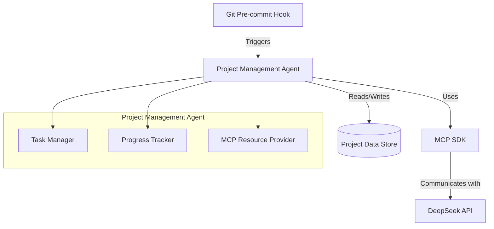

# Project Management Agent Implementation Plan

## Overview
This document outlines the plan for implementing a project management agent using the Model Context Protocol (MCP) SDK, integrated with DeepSeek API and pre-commit hooks.

## Architecture and Workflow



## Implementation Plan

1. **Set up Pre-commit Infrastructure**
   - Install pre-commit package
   - Create .pre-commit-config.yaml
   - Configure hook entry points

2. **Create Project Management Agent**
   - Implement MCP server structure
   - Create agent classes and interfaces
   - Set up DeepSeek API integration
   - Design data storage structure

3. **Implement MCP Integration**
   - Define MCP tools and resources
   - Create schemas for tool inputs/outputs
   - Set up communication protocols
   - Implement resource providers

4. **Data Management**
   - Design storage format for project data
   - Implement CRUD operations
   - Set up persistence layer
   - Add data validation

5. **Hook Integration**
   - Create pre-commit hook script
   - Implement hook logic
   - Add configuration options
   - Set up error handling

## File Structure
```
mytool/
├── .pre-commit-config.yaml
├── src/
│   ├── agent/
│   │   ├── __init__.py
│   │   ├── project_manager.py
│   │   ├── task_manager.py
│   │   └── data_store.py
│   ├── mcp/
│   │   ├── __init__.py
│   │   ├── server.py
│   │   ├── tools.py
│   │   └── resources.py
│   └── hooks/
│       └── pre_commit.py
```

## Technical Specifications

### 1. MCP Server Configuration
- Server Name: `project-tracker`
- Tools:
  - `get_project_status`
  - `analyze_risks`
  - `generate_report`
- Resources:
  - `project://tasks`
  - `project://progress`
  - `project://metrics`

### 2. Pre-commit Hook Behavior
- Trigger points: Before each commit
- Actions:
  - Update project status
  - Generate progress metrics
  - Store results in data store

### 3. DeepSeek Integration
- API configuration in environment variables
- Async request handling
- Rate limiting and error handling
- Response parsing and validation

### 4. Data Storage
- Format: JSON/YAML
- Location: `.project-data` directory
- Version control friendly
- Backup strategy

## Next Steps
1. Set up development environment
2. Implement MCP server structure
3. Create pre-commit hooks
4. Integrate DeepSeek API
5. Implement data storage
6. Add tests and documentation