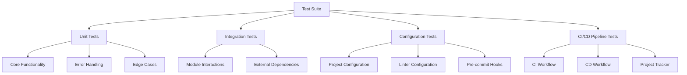

# Test Suite Plan for mytool

## Overview

## Detailed Test Plan

### 1. Unit Tests
- Test main() function output matches expected string
- Verify main() return value
- Test exception handling for KeyboardInterrupt
- Test exception handling for SystemExit
- Add tests for future functionality
- Include error case tests
- Mock external dependencies

### 2. Integration Tests
- Test package building process
- Verify pre-commit hooks execution
- Validate project tracker updates

### 3. Configuration Tests
- Validate pyproject.toml structure
- Test ruff.toml linting rules
- Verify pre-commit-config.yaml

### 4. CI/CD Pipeline Tests
- Test CI workflow steps
- Validate CD workflow triggers
- Verify PyPI publishing configuration

## Implementation Approach
1. Expand test_main.py with comprehensive test cases
2. Create new test files for:
   - test_configuration.py
   - test_workflows.py
3. Add test coverage reporting
4. Set up test automation in CI
