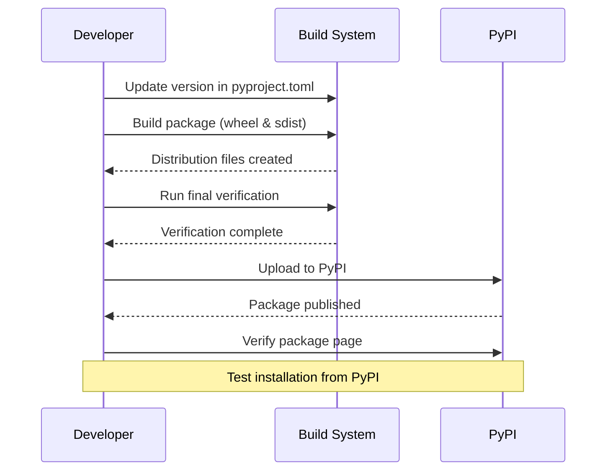

# PyPI Release Plan

## Package Overview
- Current Name: mytool
- New Name: pybop
- Version: 0.1.1
- Description: A modern Python project template using `uv` for package management

## Pre-release Checklist
1. Update package name from "mytool" to "pybop" in:
   - pyproject.toml (package name and wheel configuration)
   - source directory structure
   - import statements if needed

2. Verify Release Requirements:
   - ✅ Test coverage > 90% (current: 99.13% line, 92.11% branch)
   - ✅ Documentation is up to date (checked by pre-commit hook)
   - ✅ All tests passing
   - ✅ License file present (MIT)
   - ✅ README.md complete

3. Package Structure Updates:
   - Rename src/mytool directory to src/pybop
   - Update import paths if needed
   - Verify package structure matches pyproject.toml configuration

## Release Process Flow



## Implementation Steps

1. Version and Name Update:
   - Update version to "0.1.1" in pyproject.toml
   - Change package name to "pybop"
   - Update directory structure

2. Build Package:
   ```bash
   python -m build
   ```

3. Verify Distribution:
   - Check dist/ directory contents
   - Verify wheel and sdist files

4. Upload to PyPI:
   ```bash
   python -m twine upload dist/*
   ```

5. Post-Release Verification:
   - Check PyPI package page
   - Test installation in new environment:
     ```bash
     pip install pybop
     ```

## Required Tools
- build (for creating distribution packages)
- twine (for uploading to PyPI)
- pip (for testing installation)
